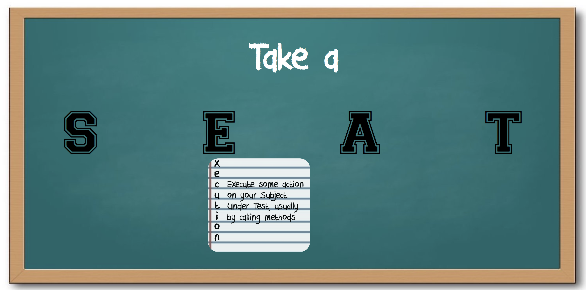
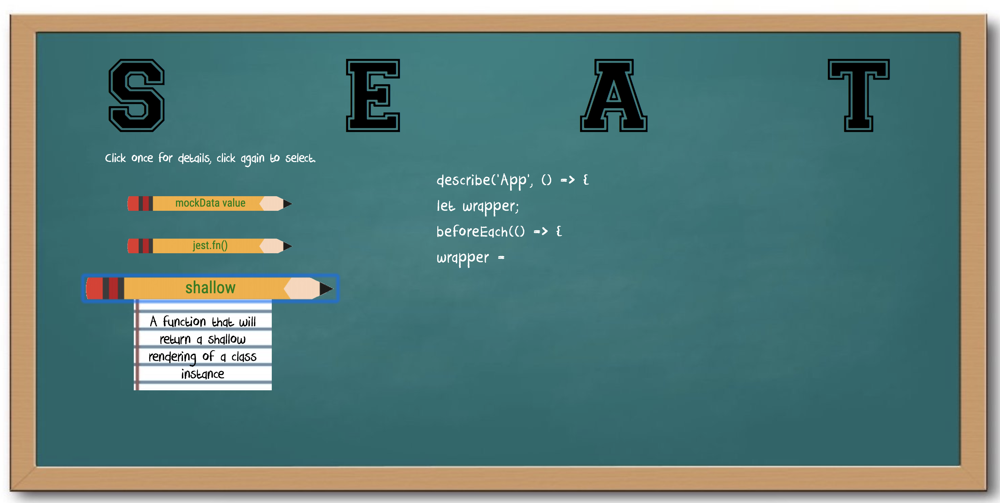

# Take a SEAT
An enzyme and jest test generator for beginner React developers. By building a test word by word, developers gain familiarity with the testing syntax and the tools at their disposal. 

## Installation
Clone the repo - https://github.com/jacobogart/Take-A-SEAT.git

Run `npm install` from the root directory

Run `npm start` and visit localhost:8080 in your browser

## Testing
Website is tested with Jest and Enzyme

Run `npm run test` to see test suite

## Learning Goals
* Build a study application with React and Sass
* Demonstrate your ability to communicate expert-level knowledge on a technical topic
* Write modular, reusable code that follows SRP (Single Responsibility Principle)
